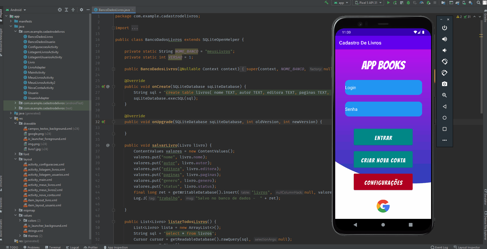

  
  <!--Adicionar logotipo do projeto aqui-->
  

    
  
 

  <h1>App Books</h1>
  
Aplicativo android, foi desenvolvido na linguagem Java, para cadastrar, atualizar e remover lista de livros, podendo ser atualizado o status de leitura do usuário

  

    
  
 

  <!--Adicionar imagem/gif do projeto aqui-->
  

       
  

  ## 🚀 Iniciar
  Para iniciar, basta clonar o repositório e abrir o projeto na IDE Android Studio, executando o App no emulador ou no seu smartphone.
  
  ## 🔨 Seja um dos contribuidores 
  Quer fazer parte desse projeto? Clique [AQUI](CONTRIBUTING.md) e leia como contribuir.

  <a href='#voltar-topo'>⬆ Voltar ao topo</a> 
