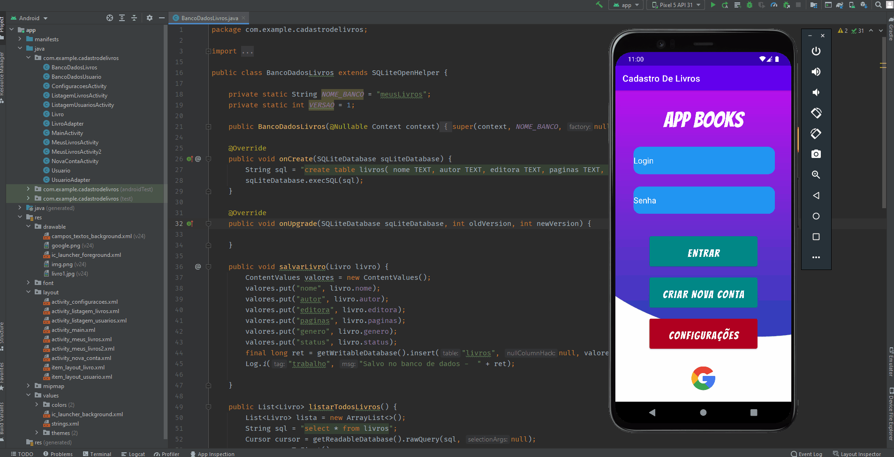

<h1 align="center">
 
  
 
 
App Books
</h1>

Aplicativo android, foi desenvolvido na linguagem JAVA, para cadastrar, 
  atualizar e remover lista de livros, Podendo ser atualizado o status da leitura do usuário

  

[//]: # (Adicionar os gifs/imagens aqui:)

  

## 🔨 Seja um dos contribuidores 

Quer fazer parte desse projeto? Clique [AQUI](CONTRIBUTING.md) e leia como contribuir.

[⬆ Voltar ao topo](App-Books) 
